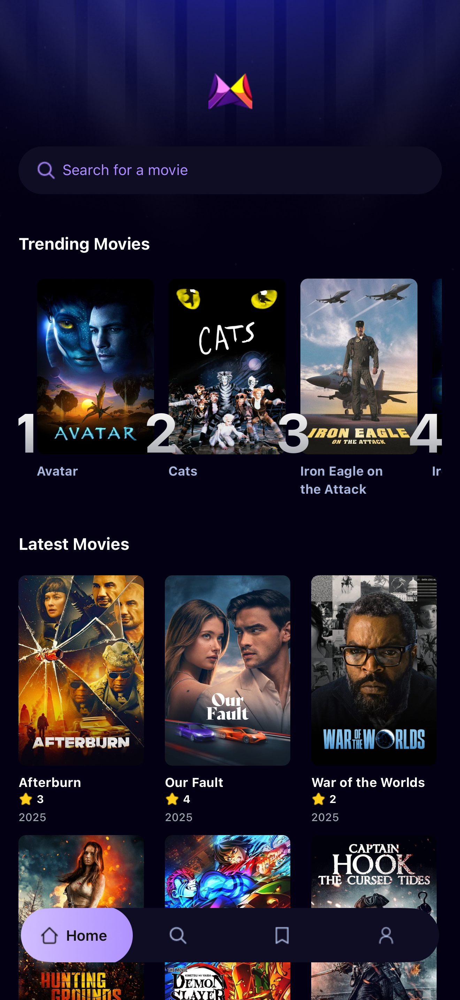
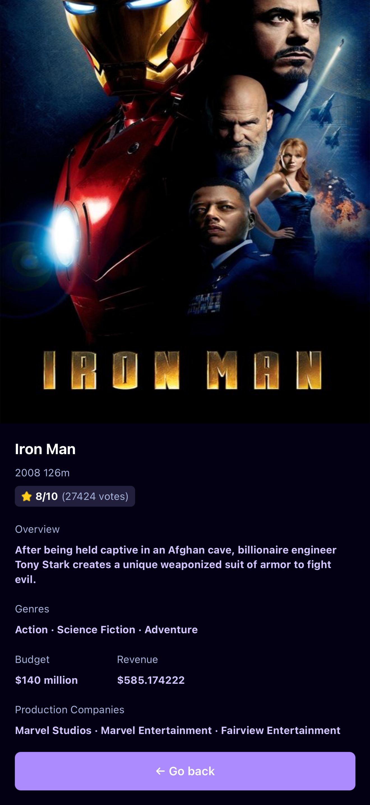

# 🎬 React Native Movie App

A mobile application built using React Native and Expo that allows users to explore movie information powered by the [`TMDB API`](https://developer.themoviedb.org/docs/getting-started).
The app also uses [`Appwrite`](https://appwrite.io/) as a backend service to track metrics such as user interactions and trending movie data.

This is an [Expo](https://expo.dev) project created with [`create-expo-app`](https://www.npmjs.com/package/create-expo-app).

## Get started

1. Clone the repository

   ```bash
   git clone https://github.com/muneefrehman/react-native-movie-app.git
   cd react-native-movie-app
   ```

2. Install dependencies

   ```bash
   npm install
   ```

3. Create a .env file
   
   Inside the root directory, create a .env file and add your API keys:

   ```bash
   EXPO_PUBLIC_MOVIE_API_KEY=<YOUR_TMDB_API_KEY>
   EXPO_PUBLIC_APPWRITE_PROJECT_ID=<YOUR_APPWRITE_PROJECT_ID>
   EXPO_PUBLIC_APPWRITE_DATABASE_ID=<YOUR_APPWRITE_DATABASE_ID>
   EXPO_PUBLIC_APPWRITE_TABLE_ID=<YOUR_APPWRITE_TABLE_ID>
   ```

5. Start the app

   ```bash
   npx expo start
   ```

In the output, you'll find options to open the app in a

- [development build](https://docs.expo.dev/develop/development-builds/introduction/)
- [Android emulator](https://docs.expo.dev/workflow/android-studio-emulator/)
- [iOS simulator](https://docs.expo.dev/workflow/ios-simulator/)
- [Expo Go](https://expo.dev/go), a limited sandbox for trying out app development with Expo

You can start developing by editing the files inside the **app** directory. This project uses [file-based routing](https://docs.expo.dev/router/introduction).

## Get a fresh project

When you're ready, run:

```bash
npm run reset-project
```

This command will move the starter code to the **app-example** directory and create a blank **app** directory where you can start developing.

## 🚀 Features

- 🔍 Browse Movies — Search and explore movies from TMDB API
- 🏆 Trending Section — Displays top trending movies based on metrics stored in Appwrite
- 🎥 Movie Details Page — View in-depth information such as synopsis, rating, and release date
- 🌗 Responsive UI — Works seamlessly on both Android and iOS devices
- ⚡ Fast and Lightweight — Built using Expo for quick builds and testing

## 🛠️ Tech Stack

| Layer | Technology |
|----------|-------------|
| Frontend | React Native (Expo) |
| API | TMDB API |
| Backend | Appwrite |
| State Management | React Hooks / Context |
| Deployment | Expo Go / EAS Build |

## How it Works

1. The app fetches data from the TMDB API to display movies.
2. User interactions (views, likes, etc.) are sent to Appwrite for tracking.
3. Appwrite aggregates metrics to generate a list of top trending movies.
4. Trending movies are fetched and displayed dynamically on the home screen.

## 📸 Screenshots

<p align="center">
  
  
  
</p>

To learn more about developing your project with Expo, look at the following resources:

- [Expo documentation](https://docs.expo.dev/): Learn fundamentals, or go into advanced topics with our [guides](https://docs.expo.dev/guides).
- [Learn Expo tutorial](https://docs.expo.dev/tutorial/introduction/): Follow a step-by-step tutorial where you'll create a project that runs on Android, iOS, and the web.

## Join the community

Join our community of developers creating universal apps.

- [Expo on GitHub](https://github.com/expo/expo): View our open source platform and contribute.
- [Discord community](https://chat.expo.dev): Chat with Expo users and ask questions.
